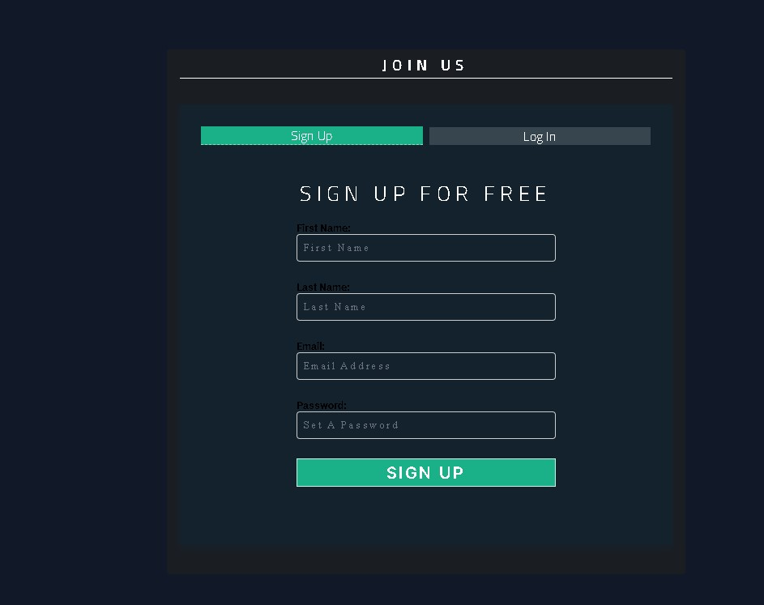
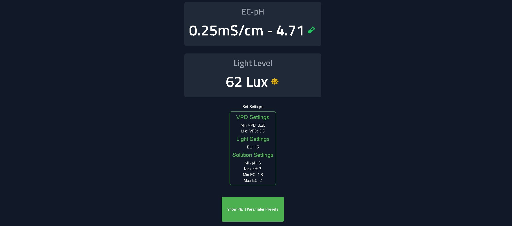
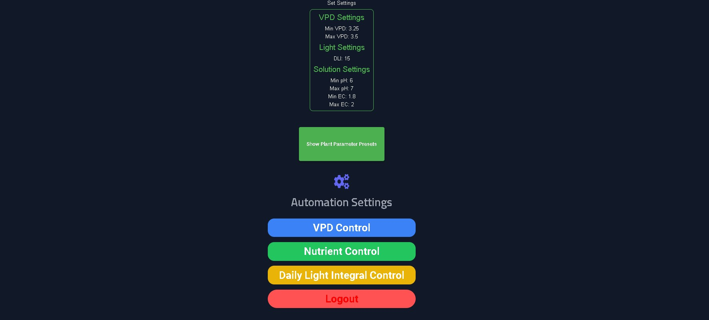
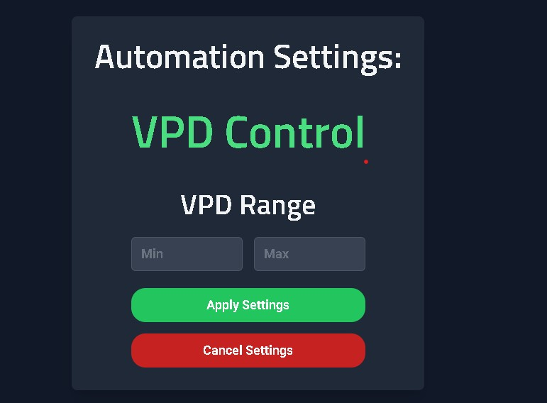
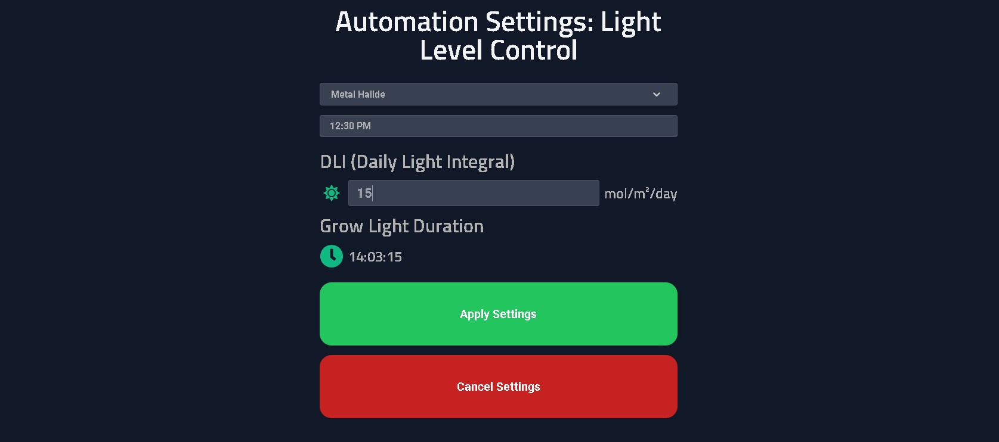
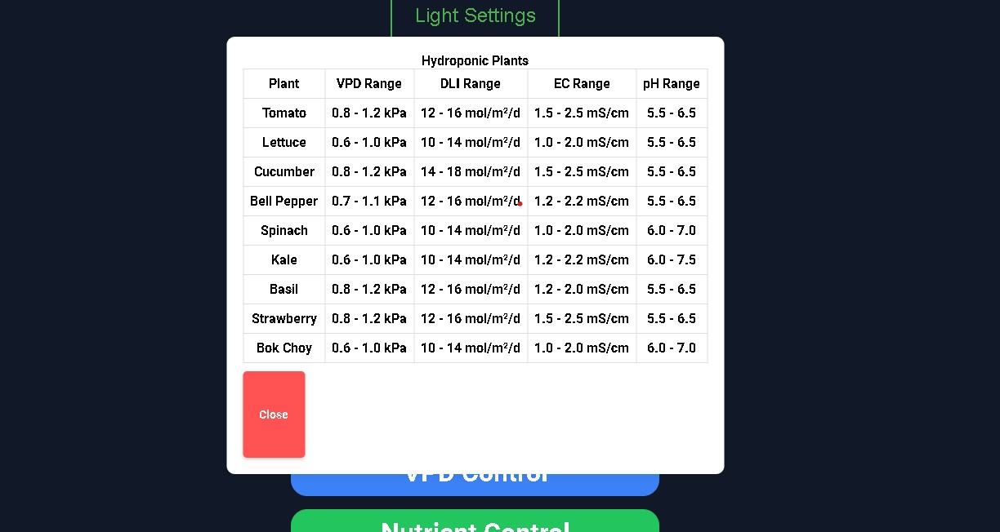
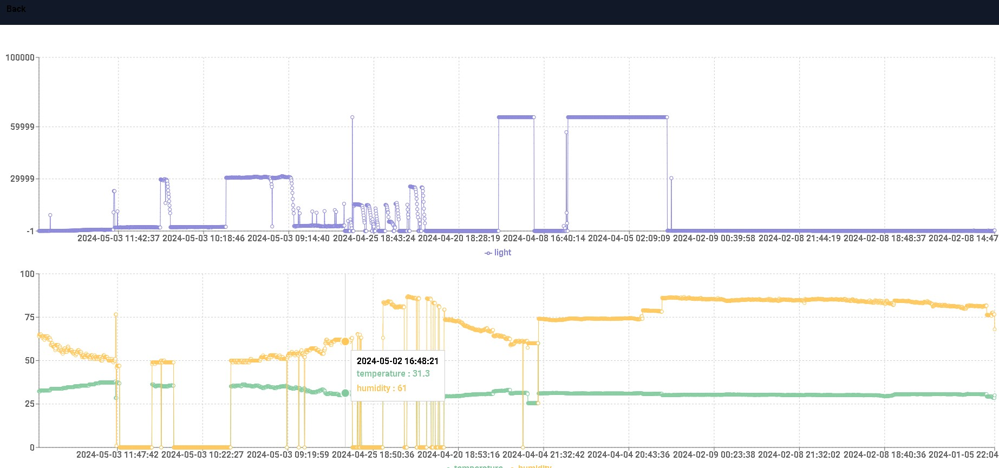
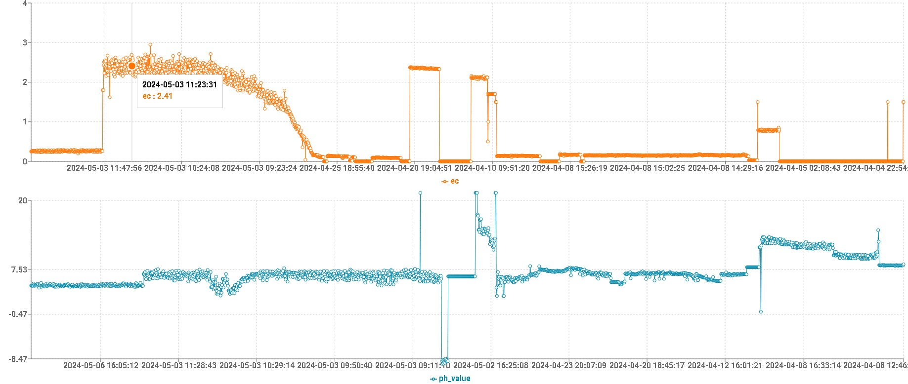
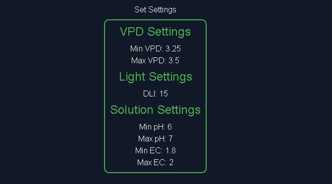

# Eco-Solution-Hydroponic-System
Hydroponics Local Based Automation using React Framework and Arduino Nano Esp32 SQL
Sensors: Sensors (temperature, humidity, pH, tsl2561 light sensor, fans, relays, ec sensor, light, dosing pumps) monitor the hydroponics environment.
Arduino Nano/ESP32: The Arduino board collects sensor data and controls actuators (water pumps, lights, dosing pumps)
I'd be glad to help you create a comprehensive README file for your Eco-Solution-Hydroponic-System project, incorporating the best aspects of the provided responses and addressing potential issues:

**Project Name:** Eco-Solution-Hydroponic-System

**Description:**

This project implements a local automation system for a hydroponics setup using a combination of technologies:

* **Frontend:** React Framework ([https://react.dev/](https://react.dev/)) - A JavaScript library for building dynamic and interactive user interfaces.
* **Backend:** PHP ([https://www.php.net/manual/en/index.php](https://www.php.net/manual/en/index.php)) with XAMPP ([https://www.apachefriends.org/download.html](https://www.apachefriends.org/download.html)) - A server-side scripting language for handling data processing and communication with the Arduino microcontroller.
* **Microcontroller:** Arduino Nano or ESP32 ([https://randomnerdtutorials.com/installing-the-esp32-board-in-arduino-ide-windows-instructions/](https://randomnerdtutorials.com/installing-the-esp32-board-in-arduino-ide-windows-instructions/)) - A programmable board that connects to sensors and actuators to control the hydroponics environment.
* **Database SQL ([https://www.w3schools.com/sql/](https://www.w3schools.com/sql/)) - Can be used to store and manage sensor data, system settings, and other relevant information (consider using a lightweight database like SQLite for this project).


**System Overview:**

1. **Sensors:** Sensors (temperature, humidity, pH, tsl2561 light sensor, fans, relays, ec sensor, light, dosing pumps) monitor the hydroponics environment.
2. **Arduino Nano/ESP32:** The Arduino board collects sensor data and controls actuators (water pumps, lights, dosing pumps) based on predefined rules or user input from the React frontend.
3. **React Frontend:** The React application displays sensor readings, allows users to adjust settings, and provides visualizations of the hydroponics system's state.
4. **PHP Backend:** Using a database, the PHP backend interacts with the database to store and retrieve sensor data, system settings, or control actions from the frontend.

**Getting Started:**

1. **Prerequisites:**
   - Basic understanding of React, PHP, Arduino programming, and hydroponics principles.
   - Node.js and npm ([https://nodejs.org/en](https://nodejs.org/en)) installed.
   - Arduino IDE ([https://www.arduino.cc/en/software](https://www.arduino.cc/en/software)) installed (if using Arduino Nano/ESP32).
   - XAMPP installed (if using PHP backend with database).
2. **Project Setup:**
   - Clone or download this project repository.
   - Install dependencies:
     ```bash
     cd Eco-Solution-Hydroponic-System
     npm install
     ```
   - (Using PHP backend) Configure XAMPP and create a database copy all the scripts to your xamp directory.
   - Connect the Arduino board to your computer and load the sketch .
   - Change the ip address based on you local network setup
   - Refer to schematics folder and modify it to your desired setup.

**Running the Project:**

1. **Frontend:**
   - Start the React development server:
     ```bash
     cd Eco-Solution-Hydroponic-System
     npm start
     ```
   - Open http://localhost:3000 (or the port specified in `package.json`) in your browser.
2. **Arduino (if applicable):**
   - Upload the Arduino code (provided in a separate file) to your Arduino board using the Arduino IDE.

**Additional Notes:**

- This README provides a high-level overview. Refer to the specific code files for detailed implementation.
- Consider implementing security measures, especially if the system is exposed to the internet.
- Regularly test and monitor your hydroponics system to ensure optimal plant growth.

**Future Enhancements:**

- Further improve the dashboard to include advanced features for data analysis and visualization, allowing users to gain deeper insights into their hydroponic environment. 
- Implement machine learning algorithms to optimize system settings based on sensor data and plant growth patterns.
- Web Deployment. Deploy the system to the web to allow access from anywhere with internet connectivity.
- Improve temperature control by using a more precise sensor or implementing regular calibration routines. Explore sophisticated control algorithms like fuzzy logic or PID control to enhance efficiency and energy consumption.
- Modify the system architecture to handle communication and control of multiple temperature regulation devices within the environment.

* **Frontend View:**
  * **Signup/Login:**
    * Signup and login to the dashboaard using your email and password credentials.
    *  
  * **Dashboard:**
    * View current sensor readings (temperature, humidity, pH).
    * Visualize sensor data (e.g., color bars, gauges).
    * See overall system status (healthy, needs attention).
    * Access to parameter settings and visualizations.
    *  
    * 
    *  
  * **Parameter Settings:**
    * Adjust desired temperature, humidity, and pH ranges.
    * Configure watering schedules (frequency, duration).
    * Define light cycle parameters (on/off times, intensity).
    * 
    * 
    * 
  * **Visualization:**
    * Track sensor readings over time (line graphs, charts).
    * Compare historical data for different parameters.
    * Visual representation of plant growth (optional).
    * 
    * 
    * 
    * 