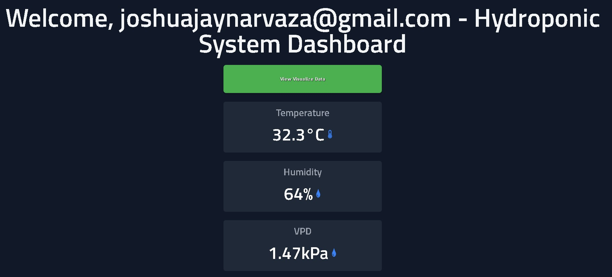

# 🌱 Eco-Solution Hydroponic System

<div align="center">
  
</div>

<div align="center">
  
  
  
  
  
  
  

  **A sophisticated IoT automation system for hydroponics using React, PHP (XAMPP), and Arduino Nano ESP32.**
  
  *Monitor, control, and optimize your hydroponic environment with precision and elegance.*

  ---

  [🚀 Getting Started](#-getting-started) • 
  [📊 System Overview](#-system-overview) • 
  [🛠️ Technologies](#️-technologies-used) • 
  [📁 Project Structure](#-project-structure) • 
  [📷 Screenshots](#-screenshots) • 
  [🤝 Contributing](#-contributing)

</div>

---

## 📊 System Overview

The **Eco-Solution Hydroponic System** seamlessly integrates cutting-edge IoT hardware with a modern web dashboard to provide comprehensive local control over hydroponic setups—no cloud dependency required.

<div align="center">
  <table>
    <tr>
      <td align="center" width="25%">
        
        <br><strong>🌿 Frontend</strong>
        <br>React-based dashboard with responsive UI
      </td>
      <td align="center" width="25%">
        
        <br><strong>🔧 Backend</strong>
        <br>PHP on XAMPP for API endpoints & data processing
      </td>
      <td align="center" width="25%">
        
        <br><strong>⚡ Hardware</strong>
        <br>Arduino Nano ESP32 for sensor control
      </td>
      <td align="center" width="25%">
        
        <br><strong>💾 Database</strong>
        <br>MySQL for readings, settings, and logs
      </td>
    </tr>
  </table>
</div>

---

## 🎯 Key Features

<div align="center">
  <table>
    <tr>
      <td width="50%">
        <h3>🔍 Real-time Monitoring</h3>
        <ul>
          <li>Temperature & Humidity (DHT11)</li>
          <li>Light Intensity (TSL2561)</li>
          <li>pH & EC Levels</li>
          <li>Water Level Detection</li>
        </ul>
      </td>
      <td width="50%">
        <h3>🤖 Automated Control</h3>
        <ul>
          <li>Smart Fan Control</li>
          <li>LED Grow Light Management</li>
          <li>Water & Dosing Pumps</li>
          <li>Relay-based Automation</li>
        </ul>
      </td>
    </tr>
    <tr>
      <td width="50%">
        <h3>📈 Data Visualization</h3>
        <ul>
          <li>Historical Charts (Chart.js)</li>
          <li>Trend Analysis & Insights</li>
          <li>Custom Time Ranges</li>
          <li>Export Capabilities</li>
        </ul>
      </td>
      <td width="50%">
        <h3>🔒 Security & Privacy</h3>
        <ul>
          <li>Email-based Authentication</li>
          <li>Local Network Only</li>
          <li>Custom Thresholds & Schedules</li>
          <li>No Cloud Dependency</li>
        </ul>
      </td>
    </tr>
  </table>
</div>

---

## 🛠️ Technologies Used

<div align="center">
  
  ### 🌿 Frontend Technologies
  
  
  

  ### 🔧 Backend Technologies
  
  
  

  ### ⚡ Hardware Components
  
  
  
  
  

  ### 📡 Communication Protocols
  
  
  

</div>

---

## 🧩 System Architecture

<div align="center">
  
</div>

```
[Sensors] ──> ESP32 (Arduino Nano) ──HTTP──> PHP API (XAMPP) ──SQL──> Database
   ▲                 │                                 │
   └─────────────────┴──────────── Web UI (React) <────┘
```

**Components:**
- **Sensors:** Temperature, humidity (DHT11), light (TSL2561), pH, EC, water level
- **Actuators:** Relays, fans, lights, pumps, dosing pumps
- **Communication:** HTTP REST API over WiFi for seamless data exchange

---

## 📁 Project Structure

<details>
<summary><strong>Click to expand project structure</strong></summary>

```
Eco-Solution-Hydroponic-System/
├── 📋 README.md
├── 📄 LICENSE
├── ⚙️ jsconfig.json
├── 📦 package.json
├── 🎨 tailwind.config.js
├── 📊 postcss.config.js
├── 🔧 .prettierrc
├── 📝 .prettierignore
├── public/
│   └── images/
│       └── Image 4.jpg            # Project cover image
├── dashboard_pages/               # UI Screenshots
│   ├── signup_login.jpg
│   ├── mainDashboard1.1.jpg
│   ├── mainDashboard1.2.jpg
│   ├── mainDashboard1.3.jpg
│   ├── vpd.jpg
│   ├── dli.jpg
│   ├── plant_parameter.jpg
│   ├── dataVisualization1.1.jpg
│   ├── dataVisualization1.2.jpg
│   └── current_setting.jpg
├── Libraries/                     # Arduino Dependencies
│   ├── Adafruit_TSL2561/
│   ├── ArduinoHttpClient/
│   ├── DHT_sensor_library/
│   └── Wire/
├── ⚡ nano_esp32_sensor_eco_solution/
│   └── nano_esp32_sensor_eco_solution.ino
├── 🌐 phpScripts/                  # Backend API (30+ endpoints)
│   ├── login.php
│   ├── dht11.php
│   ├── get_latest_temperature.php
│   ├── save_light_settings.php
│   └── ... additional endpoints
├── 🖥️ public/
│   ├── index.html
│   ├── manifest.json
│   └── robots.txt
└── 🎭 src/
    ├── App.jsx
    ├── index.jsx
    ├── Routes.jsx
    ├── assets/
    ├── components/
    ├── pages/
    │   ├── Home.jsx
    │   ├── DESKTOPMAINDASHBOARD/
    │   ├── LightLevelControl/
    │   ├── NutrientControl/
    │   ├── SensorDataGraph/
    │   ├── SignUP/
    │   └── TempControl/
    └── styles/
```

</details>

---

## 🚀 Getting Started

### 📋 Prerequisites

<div align="center">
  <table>
    <tr>
      <td align="center" width="25%">
        
        <br><strong>Node.js v14+</strong>
      </td>
      <td align="center" width="25%">
        
        <br><strong>Arduino IDE v2.0+</strong>
      </td>
      <td align="center" width="25%">
        
        <br><strong>XAMPP Stack</strong>
      </td>
      <td align="center" width="25%">
        
        <br><strong>Basic IoT Knowledge</strong>
      </td>
    </tr>
  </table>
</div>

### 🔧 Installation & Setup

1. **Clone the repository**
   ```bash
   git clone https://github.com/shintakino/Eco-Solution-Hydroponic-System.git
   cd Eco-Solution-Hydroponic-System
   ```

2. **Install frontend dependencies**
   ```bash
   npm install
   ```

3. **Configure the backend**
   - Install XAMPP and start Apache & MySQL
   - Create database and import SQL schema
   - Copy `phpScripts/` to `XAMPP/htdocs/eco-solution/`
   - Update database credentials in PHP files

4. **Upload Arduino sketch**
   - Open `nano_esp32_sensor_eco_solution.ino`
   - Install required libraries
   - Update Wi-Fi credentials and backend IP
   - Upload to Arduino Nano ESP32

5. **Wire the hardware**
   - Connect sensors and actuators
   - Verify connections and power supply

### 🏃 Running the System

<div align="center">
  <table>
    <tr>
      <td align="center" width="33%">
        <h4>🌐 Frontend</h4>
        <code>npm start</code>
        <br>Access: <a href="http://localhost:3000">localhost:3000</a>
      </td>
      <td align="center" width="33%">
        <h4>🔧 Backend</h4>
        <code>Start XAMPP</code>
        <br>Apache & MySQL services
      </td>
      <td align="center" width="33%">
        <h4>⚡ Hardware</h4>
        <code>Power ESP32</code>
        <br>Auto Wi-Fi connection
      </td>
    </tr>
  </table>
</div>

---

## 🧪 Sensors & Actuators

<div align="center">
  <table>
    <tr>
      <th width="20%">Category</th>
      <th width="80%">Components</th>
    </tr>
    <tr>
      <td><strong>📊 Sensors</strong></td>
      <td>DHT11 (Temperature/Humidity), TSL2561 (Light), pH Sensor, EC Sensor, Ultrasonic (Water Level)</td>
    </tr>
    <tr>
      <td><strong>🔧 Actuators</strong></td>
      <td>Relays, Dosing Pumps, Water Pumps, Ventilation Fans, LED Grow Lights</td>
    </tr>
  </table>
</div>

---

## 📷 Screenshots

### 🔐 Authentication System
<div align="center">
  
  <p><em>Secure email-based authentication system</em></p>
</div>

### 📊 Main Dashboard
<div align="center">
  
  <p><em>Real-time monitoring and system status overview</em></p>
  
  
  <p><em>Interactive control panels and sensor readings</em></p>
  
  
  <p><em>System analytics and performance metrics</em></p>
</div>

### ⚙️ Settings & Configuration
<div align="center">
  <div style="display: flex; justify-content: space-around; flex-wrap: wrap; gap: 20px; margin: 20px 0;">
    <div style="flex: 1; min-width: 300px; max-width: 45%;">
      
      <p><em>Vapor Pressure Deficit (VPD) Configuration</em></p>
    </div>
    <div style="flex: 1; min-width: 300px; max-width: 45%;">
      
      <p><em>Daily Light Integral (DLI) Management</em></p>
    </div>
  </div>
  
  
  <p><em>Plant-specific parameter presets and configurations</em></p>
</div>

### 📈 Data Visualization & Analytics
<div align="center">
  <div style="display: flex; justify-content: space-around; flex-wrap: wrap; gap: 20px; margin: 20px 0;">
    <div style="flex: 1; min-width: 300px; max-width: 45%;">
      
      <p><em>Light intensity and VPD trend analysis</em></p>
    </div>
    <div style="flex: 1; min-width: 300px; max-width: 45%;">
      
      <p><em>Nutrient level monitoring and adjustments</em></p>
    </div>
  </div>
  
  
  <p><em>Complete system parameter overview and current settings</em></p>
</div>

---

## 🚀 Future Enhancements

<div align="center">
  <table>
    <tr>
      <td align="center" width="33%">
        <h4>🌐 Web Deployment</h4>
        Secure remote access capabilities
      </td>
      <td align="center" width="33%">
        <h4>🤖 AI Integration</h4>
        Machine learning optimization
      </td>
      <td align="center" width="33%">
        <h4>⚙️ Advanced Control</h4>
        PID & fuzzy logic systems
      </td>
    </tr>
    <tr>
      <td align="center">
        <h4>🧩 Multi-Zone</h4>
        Support for larger grows
      </td>
      <td align="center">
        <h4>⚡ Energy Management</h4>
        Smart scheduling & optimization
      </td>
      <td align="center">
        <h4>📊 Advanced Reporting</h4>
        Automated PDF/CSV exports
      </td>
    </tr>
  </table>
</div>

---

## 🤝 Contributing

We welcome contributions from the community! Here's how you can help:

1. **🍴 Fork** the repository
2. **🌿 Create** a feature branch: `git checkout -b feature/amazing-feature`
3. **💾 Commit** your changes: `git commit -m "Add amazing feature"`
4. **🚀 Push** to the branch: `git push origin feature/amazing-feature`
5. **🔄 Open** a Pull Request

<div align="center">
  <a href="https://github.com/shintakino/Eco-Solution-Hydroponic-System/issues">
    
  </a>
  <a href="https://github.com/shintakino/Eco-Solution-Hydroponic-System/pulls">
    
  </a>
</div>

---

## 📜 License

This project is licensed under the **MIT License** - see the [LICENSE](LICENSE) file for details.

---

## 👨‍💻 About the Author

<div align="center">
  
  
  **Shintakino**
  
  *IoT Developer • Hydroponics Enthusiast • Open Source Contributor*

  [](https://github.com/shintakino)

  *"Building sustainable growing solutions through technology and innovation."*

</div>

---

<div align="center">
  
  ## 🌟 Support the Project
  
  [](https://github.com/shintakino/Eco-Solution-Hydroponic-System)
  [](https://github.com/shintakino/Eco-Solution-Hydroponic-System/fork)
  [](https://github.com/shintakino/Eco-Solution-Hydroponic-System)

  ---
  
  ### Happy Growing! 🌱
  
  *Made with ❤️ for the hydroponics community*

</div>
